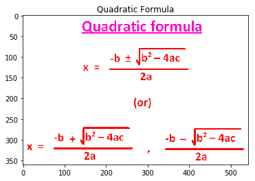
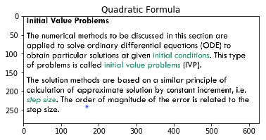
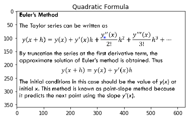
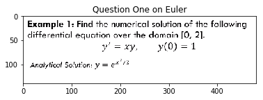
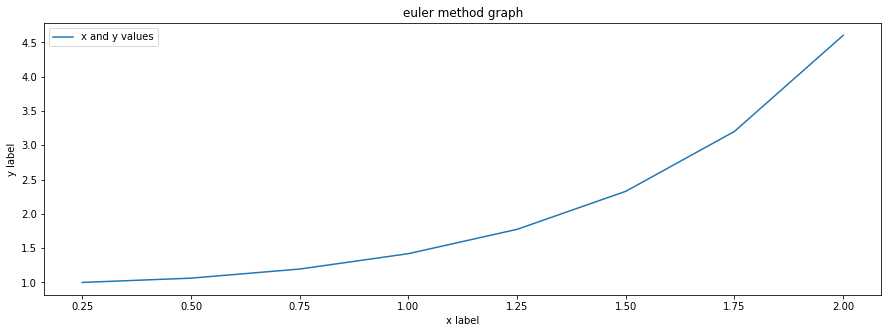

## Solving a quadratic equation


```python
!pwd
```

    /home/prady/DUDIC/DUDIC


```python
import cv2
import matplotlib.pyplot as plt

plt.title("Quadratic Formula")
quad = cv2.imread("images/quadraticformula.png")
plt.imshow(quad, cmap='gray')
```


    <matplotlib.image.AxesImage at 0x11cc987b8>





$x = [1,2,3]$

$y1 = x^2$

$y2 = y^2$


```python
# https://stackoverflow.com/a/47798853
#https://www.codecogs.com/latex/eqneditor.php


## Try yourself
## Generate inline formula yourself
```


```python
## solving quadratic equation
## Generel case

```


```python
# Solve the quadratic equation ax**2 + bx + c = 0

# import complex math module
import cmath

a = 1
b = 5
c = 6

# To take coefficient input from the users
# a = float(input('Enter a: '))
# b = float(input('Enter b: '))
# c = float(input('Enter c: '))

# calculate the discriminant
d = (b**2) - (4*a*c)

# find two solutions
sol1 = (-b-cmath.sqrt(d))/(2*a)
sol2 = (-b+cmath.sqrt(d))/(2*a)

print('The solution are {0} and {1}'.format(sol1,sol2))
```

    The solution are (-3+0j) and (-2+0j)


```python

```


```python
## complex number math function
import cmath
```


```python
def decrement(a,b,c):
    d = (b**2) - (4*a*c)
    return d

def quadratic_formula(a, b, c):
    solX = (-b - cmath.sqrt(decrement(a, b, c))) / (2*a)
    solY = (-b + cmath.sqrt(decrement(a, b, c))) / (2*a)

    print('decrement of the function is : ', decrement(a, b, c))
    
    return solX, solY
```


```python
solx , soly = quadratic_formula(1,5,6)
```

    decrement of the function is :  1


```python
print(solx)
```

    (-3+0j)


```python
print(soly)
```

    (-2+0j)


```python

```


```python
## math
```


```python
from math import sqrt
```


```python
def decrement(a,b,c):
    d = (b**2) - (4*a*c)
    return d

def quadratic_formula(a, b, c):
    solX = (-b - sqrt(decrement(a, b, c))) / (2*a)
    solY = (-b + sqrt(decrement(a, b, c))) / (2*a)

    print('decrement of the function is : ', decrement(a, b, c))
    
    return solX, solY
```


```python
solx , soly = quadratic_formula(5,20,10)
```

    decrement of the function is :  200


```python
print(solx)
```

    -3.414213562373095


```python
print(soly)
```

    -0.5857864376269049


```python

```


```python
## input to code
```


```python
from math import sqrt
```


```python
a = int(input('a: '))
b = int(input('b: '))
c = int(input('c: '))


def decrement(a,b,c):
    d = (b**2) - (4*a*c)
    return d

def quadratic_formula(a, b, c):
    solX = (-b - sqrt(decrement(a, b, c))) / (2*a)
    solY = (-b + sqrt(decrement(a, b, c))) / (2*a)

    print('decrement of the function is : ', decrement(a, b, c))
    
    return solX, solY

solx , soly = quadratic_formula(a, b, c)
print('solution of x: ',solx)
print('solution of y: ',soly)
```

    a: 1
    b: 5
    c: 6
    decrement of the function is :  1
    solution of x:  -3.0
    solution of y:  -2.0


```python

```


```python
## if else statements
```


```python
from math import sqrt

print("Quadratic function : (a * x^2) + b*x + c")

a = int(input("a: "))
b = int(input("b: "))
c = int(input("c: "))

def decrement(a=a, b=b, c=c):
    d = (b**2) - (4*a*c)
    return d

def quadratic_formula(a=a, b=b, c=c):
    solX = (-b - sqrt(decrement)) / (2*a)
    solY = (-b + sqrt(decrement)) / (2*a)

    print('decrement of the function is : ', decrement)
    
    return solX, solY

decrement = decrement()
    
if decrement > 0:
    num_roots = 2
    solx , soly = quadratic_formula()
    print('There are 2 roots x is ', solx, 'y root is ', soly)
    
elif decrement == 0:
    num_roots = 1
    x = (-b) / (2*a)
    print('there are ', num_roots, ' here ', x)

else:
    num_roots = 0
    print('No roots, decrement ')
```

    Quadratic function : (a * x^2) + b*x + c
    a: 1
    b: 10
    c: 2
    decrement of the function is :  92
    There are 2 roots x is  -9.79583152331272 y root is  -0.2041684766872809


```python

```


```python

```

## Factorial of a number


```python
## iterative method

## basic method
```


```python
## value of different result
num = int(input('Enter a number: '))
factorial = int(input('Enter factorial for '))

if num < 0:
    print('No Factorial of a number')
elif num == 0:
    print('The Factorial of 0 is 1')
else:
    for i in range(1, num+1):
        factorial = factorial*i
        print('the factorial of ', factorial)
```

    Enter a number: 1
    Enter factorial for 2
    the factorial of  2


```python

```


```python
## 3
```


```python
## 3 x 2 x 1
```


```python

```


```python
def factorial_formula(number, factorial = 1):
    for i in range(1, number+1):
        factorial = factorial * i
    print('factorial of ', number, 'is', factorial)

def check(number, factorial):
    if num < 0:
        print('No Factorial of a number')
    elif num == 0:
        print('The Factorial of 0 is 1')
    else:
        factorial_formula(num, fact_num)


num = int(input('Enter a number: '))
fact_num = int(input('Enter factorial for '))
check(num, fact_num)
```

    Enter a number: 3
    Enter factorial for 1
    factorial of  3 is 6


```python
print(type(num))
```

    <class 'int'>


```python
print(type(factorial_formula))
```

    <class 'function'>


```python

```


```python
def recursive_factorial(number , factorial = 1):
    """
    recursive function
    """
    if number == 1:
        return number
    else:
        return number * recursive_factorial(number - 1)

def check(number, factorial):
    """
    
    """
    if num < 0:
        print('No Factorial of a number')
    elif num == 0:
        print('The Factorial of 0 is 1')
    else:
        print('factorial of ', number,' is ', recursive_factorial(number, factorial))

num = int(input('Enter a number: '))
fact_num = int(input('Enter factorial for '))
check(num, fact_num)
```

    Enter a number: 7
    Enter factorial for 1
    factorial of  7  is  5040


```python

```

## Statistics

    -mean
    -median
    -variance
    -std


```python
import statistics?
```

    Object `statistics` not found.


```python
import statistics
```


```python
statistics?
```


```python

```


```python
my_list = [4, 7, 0, 3]
my_iter = iter(my_list)


print(next(my_iter))
print(next(my_iter))

print(my_iter.__next__())
```

    4
    7
    0


```python
mean = 0
if len(my_list) < 1:
    for element in my_list:
        mean = mean + element

print('total mean :', mean/len(my_list))
```

    total mean : 0.0


```python
## object for the loop
iter_object = iter(my_list)
```


```python
while True:
    try:
        # get the next element
        element = next(iter_object)
        print(element)
        ## do something with element
    except StopIteration:
        break
```

    4
    7
    0
    3


```python
len(my_list)
```


    4


```python

```


```python
my_list = [4, 7, 0, 3]

def mean(my_list):
    final_mean = 0
    if len(my_list) > 1:
        print(len(my_list))
        for element in my_list:
            final_mean = final_mean + element
    return final_mean

print('total mean :', int(mean(my_list)/len(my_list)))
```

    4
    total mean : 3


```python

```


```python
import statistics

data1 = [4, 7, 0, 3]
final_mean = statistics.mean(data1)
print(final_mean)
```

    3.5


```python
import statistics

data1 = [2, -2, 3, 6, 9, 4, 5, -1]

final_median = statistics.median(data1)
print(final_median)
```

    3.5


```python
# median
# https://stackoverflow.com/a/24101534
```


```python
data1 = [2, -2, 3, 6, 9, 4, 5, -1]

def median(lst):
    sortedlist = sorted(lst)
    print('sorted list is:  ', sortedlist)
    
    lenlst = len(lst)
    print('length of the element is: ', lenlst)
    
    index = (lenlst - 1) // 2
    print('index of element is: ', index)
    
    if(lenlst % 2):
        return sortedlist[index]
    else:
        return (sortedlist[index] + sortedlist[index + 1])/2
        
median(data1)
```

    sorted list is:   [-2, -1, 2, 3, 4, 5, 6, 9]
    length of the element is:  8
    index of element is:  3


    3.5


```python
## variance method
```


```python
print(statistics.variance(data1)) 
```

    13.071428571428571


```python
## standard deviation
```


```python
print(statistics.stdev(data1)) 
```

    3.615443067098218


```python

```


```python

```

## Euler Method


```python
import cv2
import matplotlib.pyplot as plt

plt.title("Quadratic Formula")
quad = cv2.imread("images/1.png")
plt.imshow(quad)
```


    <matplotlib.image.AxesImage at 0x11b317e10>





```python
import cv2
import matplotlib.pyplot as plt

plt.title("Quadratic Formula")
quad = cv2.imread("images/2.png")
plt.imshow(quad)
```


    <matplotlib.image.AxesImage at 0x11a968d68>





```python
import cv2
import matplotlib.pyplot as plt

plt.title("Question One on Euler")
quad = cv2.imread("images/3.png")
plt.imshow(quad)
```


    <matplotlib.image.AxesImage at 0x11b7d05c0>





```python
def dy(x,y):
    z = x*y
    return z

# [0 , 2]
x = 0
xn = 2

#y(0) = 1
y = 1

## step size
h = 0.5

print('x \t\t y')
n = int((xn - x)/h)

for i in range(n):
    y = y + dy(x,y)*h
    x = x + h
    print(y, '\t\t', x)
```

    x 		 y
    1.0 		 0.5
    1.25 		 1.0
    1.875 		 1.5
    3.28125 		 2.0


```python
import matplotlib.pyplot as plt
```


```python
from math import exp

# dy = function(x,y)
def dy(x,y):
    z = x*y
    return z

def final(x):
    f = exp(x**2/2)
    return f

## inital value of x and final value of x
# [0 , 2]
x = 0
xn = 2

#value y(0) = 1
y = 1

## step size
h = 0.25

## Table Header
print('x \t\t y(Euler) \t y(Analytical)')

## Total number of steps
n = int((xn - x)/h)

## format output
print(y, '\t\t', x, '\t', final(x))

listx = []
listy = []
listf = []

for i in range(n):
    y = y + dy(x,y)*h ## next y
    x = x + h         ## x increament
    print(y, '\t\t', x,  '\t\t ', final(x))
    listx.append(x)
    listy.append(y)
    listf.append(final(x))

# print(len(listx))
# print(len(listy))
# print(len(listf))

plt.figure(figsize=(15, 5))
plt.plot(listx , listy, label='x and y values')
plt.title('euler method graph')
plt.legend()
plt.xlabel('x label')
plt.ylabel('y label')
```

    x 		 y(Euler) 	 y(Analytical)
    1 		 0 	 1.0
    1.0 		 0.25 		  1.0317434074991028
    1.0625 		 0.5 		  1.1331484530668263
    1.1953125 		 0.75 		  1.3247847587288655
    1.41943359375 		 1.0 		  1.6487212707001282
    1.7742919921875 		 1.25 		  2.184200810815618
    2.3287582397460938 		 1.5 		  3.080216848918031
    3.202042579650879 		 1.75 		  4.6239531527820805
    4.602936208248138 		 2.0 		  7.38905609893065


    Text(0, 0.5, 'y label')





```python
!pip install tabulate
```

    Collecting tabulate
    [?25l  Downloading https://files.pythonhosted.org/packages/66/d4/977fdd5186b7cdbb7c43a7aac7c5e4e0337a84cb802e154616f3cfc84563/tabulate-0.8.5.tar.gz (45kB)
         |████████████████████████████████| 51kB 51kB/s eta 0:00:01
    [?25hBuilding wheels for collected packages: tabulate
      Building wheel for tabulate (setup.py) ... [?25ldone
    [?25h  Created wheel for tabulate: filename=tabulate-0.8.5-cp36-none-any.whl size=22456 sha256=07652a2176e259e3215592f66e5509b61c9f4d571e614bda31081231a8e8ad3f
      Stored in directory: /Users/pradyumgupta/Library/Caches/pip/wheels/e1/41/5e/e201f95d90fc84f93aa629b6638adacda680fe63aac47174ab
    Successfully built tabulate
    Installing collected packages: tabulate
    Successfully installed tabulate-0.8.5
    WARNING: You are using pip version 19.2.2, however version 19.2.3 is available.
    You should consider upgrading via the 'pip install --upgrade pip' command.


```python
from tabulate import tabulate
```


```python
# print(tabulate([listx, listy, listf], headers=['x', 'y(Euler)', 'y(Analytical)']))
```


```python

```

## Trapezoidal Rule


```python
# !open .
```
"""
Compute the area of the curve by dividing the area into strips

Each Area is calculated by Mathematical Rules

Summed together to get the total Area under the curve
""""""
Cross Section Formula

A = h[f(x0) + f(x1)]/2
"""Display Image for the Area

```python

```


```python

```


```python

```


```python

```


```python

```


```python

```


```python

```


```python
# from math import sin, pi

# ## defination of function
# def question(x):
#     return x*sin(x)

# ## lower limit of integration
# a = 0
# b = pi/2
# n = 5
```


```python
## width of the division
# h = (b - a)/n
```


```python

```

## Plotting a graph


```python
!pip3 install matplotlib
```

    Requirement already satisfied: matplotlib in /usr/local/lib/python3.6/site-packages (3.0.2)
    Requirement already satisfied: numpy>=1.10.0 in /usr/local/lib/python3.6/site-packages (from matplotlib) (1.16.2)
    Requirement already satisfied: kiwisolver>=1.0.1 in /usr/local/lib/python3.6/site-packages (from matplotlib) (1.0.1)
    Requirement already satisfied: cycler>=0.10 in /usr/local/lib/python3.6/site-packages (from matplotlib) (0.10.0)
    Requirement already satisfied: pyparsing!=2.0.4,!=2.1.2,!=2.1.6,>=2.0.1 in /usr/local/lib/python3.6/site-packages (from matplotlib) (2.3.1)
    Requirement already satisfied: python-dateutil>=2.1 in /usr/local/lib/python3.6/site-packages (from matplotlib) (2.8.0)
    Requirement already satisfied: setuptools in /usr/local/lib/python3.6/site-packages (from kiwisolver>=1.0.1->matplotlib) (41.0.0)
    Requirement already satisfied: six in /usr/local/lib/python3.6/site-packages (from cycler>=0.10->matplotlib) (1.12.0)


```python
!pip -V
```

    pip 19.2.3 from /usr/local/lib/python3.6/site-packages/pip (python 3.6)


```python
!pip uninstall matplotlib
```

    WARNING: Skipping matplotlib as it is not installed.


```python
!pip install matplotlib
```

    Collecting matplotlib
    [?25l  Downloading https://files.pythonhosted.org/packages/cf/a4/d5387a74204542a60ad1baa84cd2d3353c330e59be8cf2d47c0b11d3cde8/matplotlib-3.1.1-cp36-cp36m-macosx_10_6_intel.macosx_10_9_intel.macosx_10_9_x86_64.macosx_10_10_intel.macosx_10_10_x86_64.whl (14.4MB)
         |████████████████████████████████| 14.4MB 5.7MB/s eta 0:00:01    |█████████▌                      | 4.2MB 2.1MB/s eta 0:00:05
    [?25hRequirement already satisfied: numpy>=1.11 in /usr/local/lib/python3.6/site-packages (from matplotlib) (1.16.2)
    Requirement already satisfied: python-dateutil>=2.1 in /usr/local/lib/python3.6/site-packages (from matplotlib) (2.8.0)
    Requirement already satisfied: cycler>=0.10 in /usr/local/lib/python3.6/site-packages (from matplotlib) (0.10.0)
    Requirement already satisfied: kiwisolver>=1.0.1 in /usr/local/lib/python3.6/site-packages (from matplotlib) (1.0.1)
    Requirement already satisfied: pyparsing!=2.0.4,!=2.1.2,!=2.1.6,>=2.0.1 in /usr/local/lib/python3.6/site-packages (from matplotlib) (2.3.1)
    Requirement already satisfied: six>=1.5 in /usr/local/lib/python3.6/site-packages (from python-dateutil>=2.1->matplotlib) (1.12.0)
    Requirement already satisfied: setuptools in /usr/local/lib/python3.6/site-packages (from kiwisolver>=1.0.1->matplotlib) (41.0.0)
    Installing collected packages: matplotlib
    Successfully installed matplotlib-3.1.1


```python
import matplotlib.pyplot as plt
```


    ---------------------------------------------------------------------------

    AttributeError                            Traceback (most recent call last)

    <ipython-input-21-a0d2faabd9e9> in <module>
    ----> 1 import matplotlib.pyplot as plt
    

    /usr/local/lib/python3.6/site-packages/matplotlib/pyplot.py in <module>
         31 import matplotlib
         32 import matplotlib.colorbar
    ---> 33 import matplotlib.image
         34 from matplotlib import rcsetup, style
         35 from matplotlib import _pylab_helpers, interactive


    /usr/local/lib/python3.6/site-packages/matplotlib/image.py in <module>
       1271 
       1272 
    -> 1273 class BboxImage(_ImageBase):
       1274     """The Image class whose size is determined by the given bbox."""
       1275 


    /usr/local/lib/python3.6/site-packages/matplotlib/image.py in BboxImage()
       1274     """The Image class whose size is determined by the given bbox."""
       1275 
    -> 1276     @cbook._delete_parameter("3.1", "interp_at_native")
       1277     def __init__(self, bbox,
       1278                  cmap=None,


    AttributeError: module 'matplotlib.cbook' has no attribute '_delete_parameter'


```python
import matplotlib.pyplot as plt

dim_x = [25, 26, 27, 28, 29, 30, 31, 32]

dim_y = [3909, 8298, 8291, 2038, 2378, 2121, 4242, 2121]

dim_z = [1010, 1022, 1111, 2211, 21212, 3223, 121212, 9090]

# plt.plot(dim_x, dim_y)
#
# plt.plot(dim_x, dim_z)

### Plot maps
plt.plot(dim_x, dim_y, 'k--', label='All Devs')

plt.plot(dim_x, dim_z, 'b', label='Python')

plt.xlabel('Ages')

plt.ylabel('Median Salary (USD)')

plt.title('Median Salary (USD) by AGE')

plt.legend()

plt.show()

```


    ---------------------------------------------------------------------------

    AttributeError                            Traceback (most recent call last)

    <ipython-input-23-b332b5957143> in <module>
    ----> 1 import matplotlib.pyplot as plt
          2 
          3 dim_x = [25, 26, 27, 28, 29, 30, 31, 32]
          4 
          5 dim_y = [3909, 8298, 8291, 2038, 2378, 2121, 4242, 2121]


    /usr/local/lib/python3.6/site-packages/matplotlib/pyplot.py in <module>
         31 import matplotlib
         32 import matplotlib.colorbar
    ---> 33 import matplotlib.image
         34 from matplotlib import rcsetup, style
         35 from matplotlib import _pylab_helpers, interactive


    /usr/local/lib/python3.6/site-packages/matplotlib/image.py in <module>
       1271 
       1272 
    -> 1273 class BboxImage(_ImageBase):
       1274     """The Image class whose size is determined by the given bbox."""
       1275 


    /usr/local/lib/python3.6/site-packages/matplotlib/image.py in BboxImage()
       1274     """The Image class whose size is determined by the given bbox."""
       1275 
    -> 1276     @cbook._delete_parameter("3.1", "interp_at_native")
       1277     def __init__(self, bbox,
       1278                  cmap=None,


    AttributeError: module 'matplotlib.cbook' has no attribute '_delete_parameter'


```python

```


```python

```


```python

```
